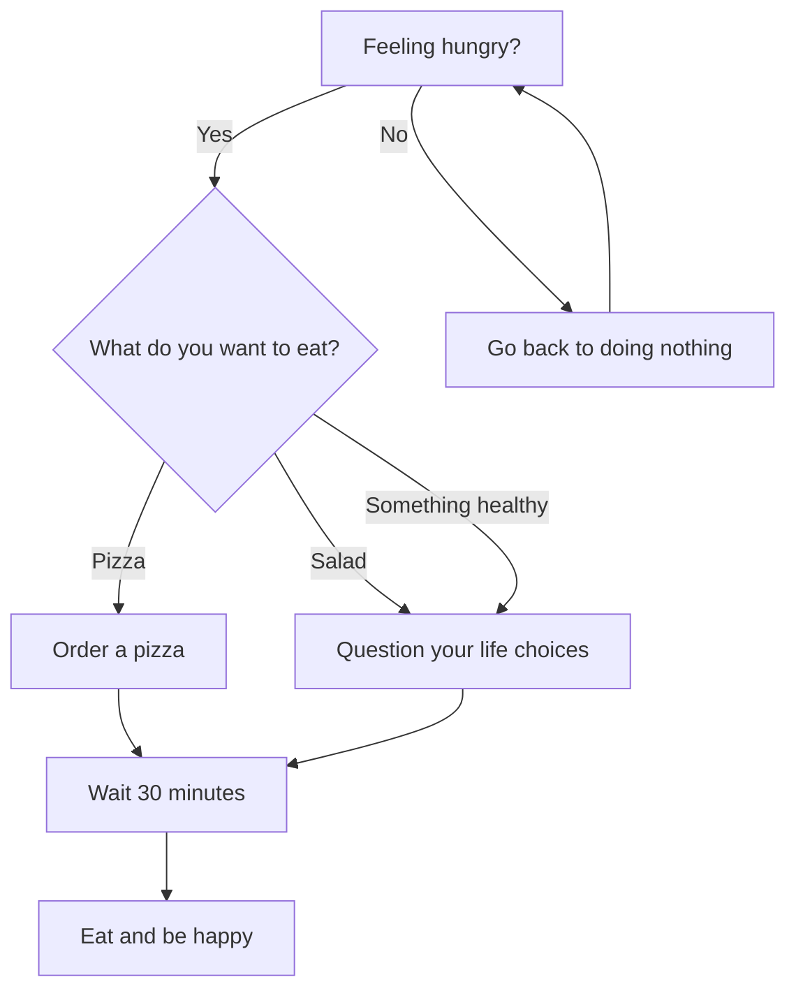
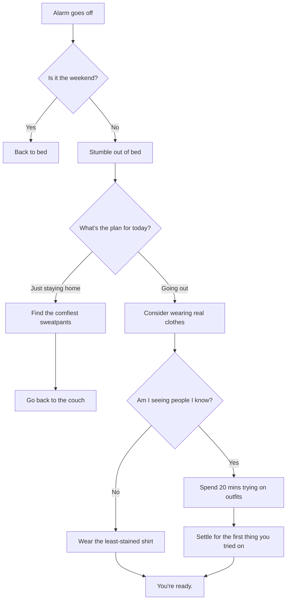

# Import

Hello world\
New line\
another line

There are two methods for importing content into GitBook:

1. [Using our import tool](<README (2).md#using-our-import-tool>)
2. [Using Git Sync](<README (2).md#importing-via-git-sync>)

#### Using our import tool

You can migrate and unify existing documentation in GitBook using the import tool. You have the option to import single or multiple pages — although some limits apply, which we’ll explain below.


**Permissions**\
Only users with [editor permissions or higher](account-management/member-management/roles.md) can edit pages.


**Supported import formats**

GitBook supports imports from websites or files in the following formats:

* Markdown (.md or .markdown)
* HTML (.html)
* Microsoft Word (.docx)

We also support imports from:

* Confluence
* Notion
* GitHub Wiki
* Quip
* Dropbox Paper
* Google Docs

If you want to **import multiple pages**, you can upload a ZIP file containing HTML or Markdown files.

**The Import panel**

When you create a new [space](content-editor/editor/content-structure/what-is-a-space.md), you’ll have the option to import content from the bottom sheet of the first empty page:

Alternatively, you can always import a page or subpage by selecting **New page** > **Import new pages** in the [table of contents](content-editor/editor/navigation.md#table-of-contents), or opening the Actions menu  for a page and choosing **Import subpages**.

<figure><figcaption>
There are two ways to import content into GitBook.
</figcaption></figure>

After choosing an input source, you can select the file you’d like to import.


Although GitBook supports importing content from different sources, the result may differ from your source due to differences in product features and document formats.


**Limitations**

GitBook currently has the following limits for imported content:

* The maximum number of pages that can be uploaded in a single import is **20**.
* The maximum number of files (images etc.) that can be uploaded in a single import is **20**.

#### Importing via Git Sync

If you want to import large amounts of content, you can use our [Git Sync](integrations/git-sync/) feature, which has no limitation on the amount of content that can be imported.

To import using Git Sync, you’ll first need to add your content to a GitHub or GitLab repository — or folder if you're using a monorepo setup — as Markdown files. If your current tool does not support Markdown export, various online tools can assist with conversion from other formats, such as PDF, HTML, etc.

Once you’ve set up your Git repository, simply [set up a Git Sync integration](integrations/git-sync/) in your GitBook organization. Be sure to select the direction **GitHub -> GitBook** when choosing the initial sync direction.


If you’re having trouble with the import process using either method above, please [get in touch with our support team](mailto:support@gitbook.com) — they’d be happy to help.

